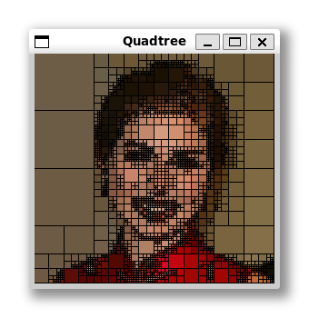

# Quadtree para compressão de imagens

| Antes 	| Depois 	|
|:---:	|:---:	|
|  	|  	|


Este é um projeto de programação em C que implementa a compressão de imagens utilizando quadtree. A quadtree é uma estrutura de dados em forma de árvore, onde cada nó pode ter zero ou quatro nós filhos. Neste trabalho, exploraremos os conceitos de programação em C e o uso de ponteiros em uma estrutura de árvore para criar um programa capaz de ler uma imagem e gerar uma quadtree que representa essa imagem. Também será fornecido um código para visualizar a quadtree gerada.

## Funcionamento

O programa principal do projeto segue os seguintes passos:

1. Leitura de uma imagem colorida, onde cada pixel é representado pelas intensidades das cores vermelho, verde e azul (RGB), armazenadas como unsigned char.
2. Obtenção do menor erro desejado, fornecido pelo usuário. Esse valor representa o desvio padrão das intensidades dos pixels de cada região.
3. Geração da quadtree e chamada das funções para visualização e salvamento da quadtree em um arquivo.

O programa de exemplo recebe o nome da imagem a ser carregada como o primeiro parâmetro da linha de comando. A imagem original é exibida em uma janela, e as seguintes teclas podem ser utilizadas:

- `ESC`: libera a memória e encerra o programa.
- `=`: aumenta o nível de erro atual em uma unidade, recriando a quadtree.
- `-`: reduz o nível de erro atual em uma unidade, recriando a quadtree.
- `b`: liga/desliga o desenho das bordas de cada região.
- `r`: recria e desenha a quadtree, sem alterar o nível de erro.
- `w`: salva a quadtree em disco no formato de entrada do Graphviz (.dot).

Para visualizar as bordas das regiões da quadtree na ferramenta Graphviz, é necessário gerar a quadtree previamente.

## Etapas do algoritmo de geração da quadtree

O algoritmo de geração da quadtree é recursivo e segue as seguintes etapas:

1. Conversão da imagem para tons de cinza.
2. Inicialmente, há apenas uma única região abrangendo toda a imagem. À medida que o algoritmo é executado, novas regiões são criadas e são realizadas as seguintes tarefas:
   - Cálculo da cor média da região.
   - Cálculo do histograma da região em tons de cinza.
   - Cálculo do nível de erro da região a partir do histograma.
   - Se o nível de erro for inferior ao erro mínimo especificado pelo usuário, o processo termina para essa região.
   - Caso contrário, a região é subdividida em quatro e o algoritmo é aplicado recursivamente a cada uma delas.

## Execução

Para testar o projeto, basta compilar o projeto com `make` no UNIX ou `mingw32-make` no Windows:
```bash
make -f Makefile
```

```cmd
mingw32-make.exe -f Makefile.mk
```
